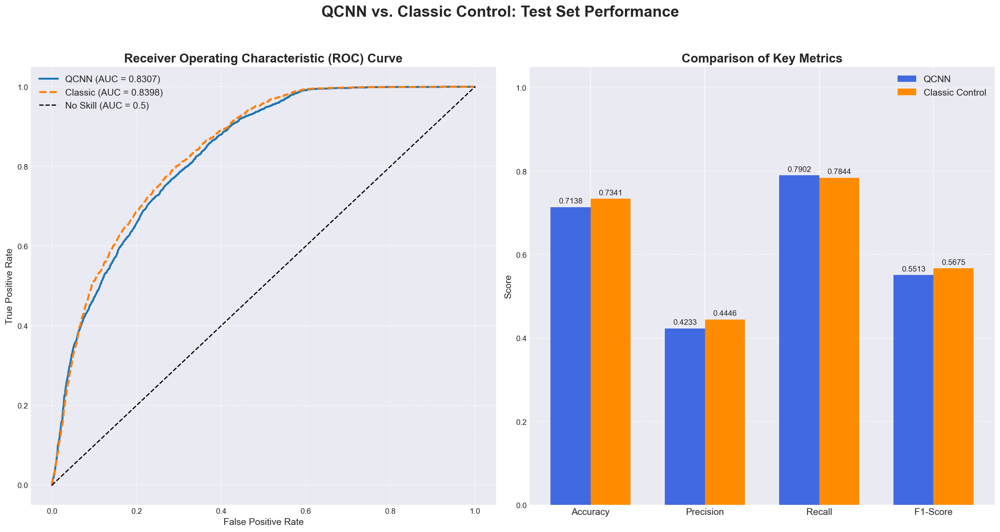

# ⚛️ Quantum vs. Classical CNN: Melanoma Detection Research


This repository documents a series of experiments investigating **Quantum Convolutional Neural Networks (QCNN)**. The goal was to determine if quantum entanglement could provide a "Quantum Advantage" over classical CNNs in a low-data medical imaging environment.

---

## 🔗 Project Context & Relationship
This research was conducted to benchmark the efficiency of our **High-Performance Melanoma Detection System**.

* **🧪 This Repository (Research):** Focused on **hypothesis testing** using Hybrid Quantum-Classical networks. It prioritizes scientific exploration over raw accuracy.
* **🚀 The Main Project (Production):** A highly optimized classical system (ConvNeXt Ensemble) that achieved **98.59% Recall** and clinical viability.
    * 👉 **[View the High-Performance Classical Model Here](https://github.com/Agovvvvv/deep-learning-melanoma-detection)**

---

## 📝 Abstract / Executive Summary

Does adding a quantum processing layer improve deep learning performance for melanoma detection? **Our results suggest: No.**

We tested multiple "Quanvolutional" architectures against identical classical control models. While the QCNNs successfully learned to classify images (achieving ~0.83 AUC), they consistently failed to outperform standard classical convolutions in accuracy, precision, or training efficiency.

---

## 🧪 Experiment 1: The "Bottleneck" Approach

**Hypothesis:** Using a quantum circuit as a final classifier on top of a frozen, deep feature extractor (ConvNeXt).

* **Architecture:** ConvNeXtBase (Frozen) → 8-Qubit Quantum Circuit.
* **Result:** ❌ **Failure.** The quantum layer performed no better than a linear layer.
* **Analysis:** The rich 1024-dimensional features from ConvNeXt were crushed into 8 qubits, creating a severe **information bottleneck**. The quantum circuit was "starved" of data.

---

## 🔬 Experiment 2: The "Quanvolutional" Layer

We redesigned the architecture to use the QCNN as a **core processing layer** (feature extractor) rather than a classifier.

### The Setup
1.  **Input:** 3,000 balanced images (Melanoma/Benign).
2.  **Quantum Model:** A hybrid CNN where the central filter is a **Parameterized Quantum Circuit (PQC)** scanning the image.
3.  **Control Model:** An identical architecture replacing the quantum layer with a standard `nn.Conv2d` (Classical Convolution).

> 🔑 **Control Variable:** This design isolated exactly one variable: **Quantum Filter vs. Classical Filter**.

### Iterations & Failures

| Iteration | Circuit Type | Result |
| :--- | :--- | :--- |
| **2.1** | 2-Layer `StronglyEntangling` | **Identical Performance.** The quantum layer added no value over a 1x1 convolution. |
| **2.2** | 4-Layer `StronglyEntangling` | **Worse Performance.** The circuit was too complex, leading to overfitting on the "Positive Weight" loss metric. |
| **2.3** | 16-Qubit Wide Circuit | **Computational Failure.** Exponential scaling ($2^{16}$) made simulation impossibly slow on classical hardware. |

---

## 🏆 Experiment 3: The Final Definitive Test

We simplified the circuit to avoid "Barren Plateaus" and removed loss-function biases to run a fair, head-to-head comparison.

* **Circuit:** `qml.BasicEntanglerLayers` (4 layers).
* **Training Data:** 3,000 Balanced Images.
* **Test Data:** 9,942 Unseen Images.

### 📊 Results


*Figure 1: QCNN vs Classic Test Results.*

| Metric | QCNN (Quantum) | Classic Control | 🏅 Winner |
|--------|----------------|-----------------|-----------|
| **AUC** | 0.8307 | **0.8398** | 🟦 Classic |
| **Accuracy** | 0.7138 | **0.7341** | 🟦 Classic |
| **F1-Score** | 0.5513 | **0.5675** | 🟦 Classic |
| **Recall** | **0.7902** | 0.7844 | 🟨 QCNN |
| **Precision** | 0.4233 | **0.4446** | 🟦 Classic |

### 🎓 Conclusion
The QCNN learned to be **"recall-focused,"** but at the cost of precision. The classical model proved to be a more balanced and effective classifier across every key metric. Furthermore, the quantum simulation was **exponentially slower** to train.

**Final Verdict:** For this specific task and architecture, Classical Deep Learning remains superior.

---

## 💻 How to Run This Experiment

### Prerequisites
You will need `PyTorch` and `PennyLane` (for quantum simulation).

```bash
pip install torch torchvision pennylane matplotlib scikit-learn